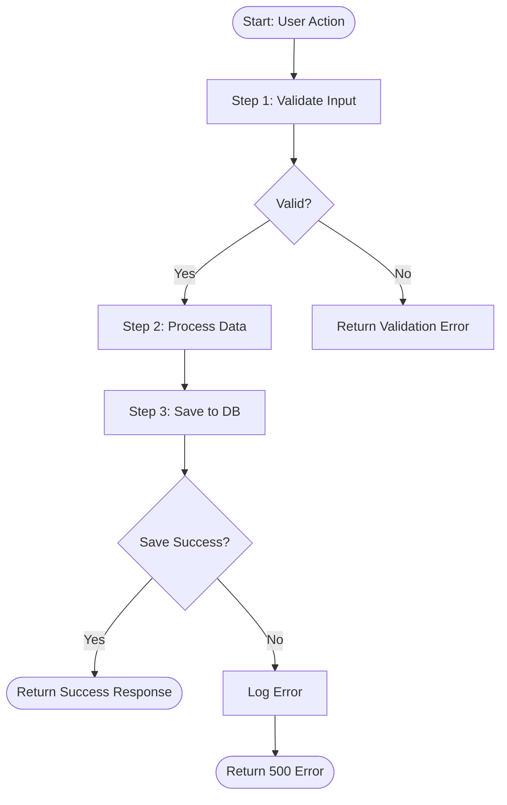
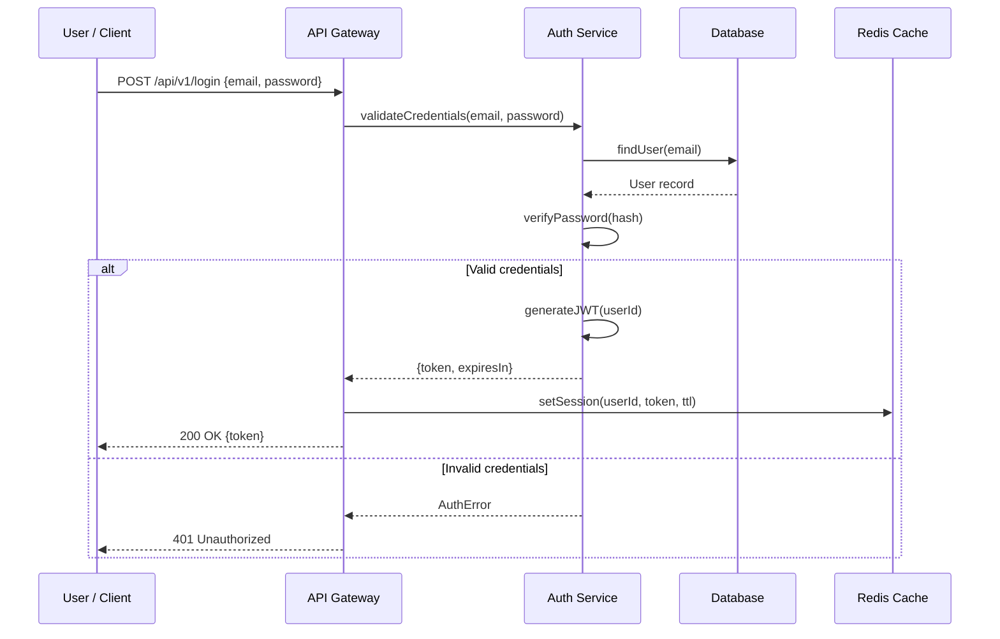
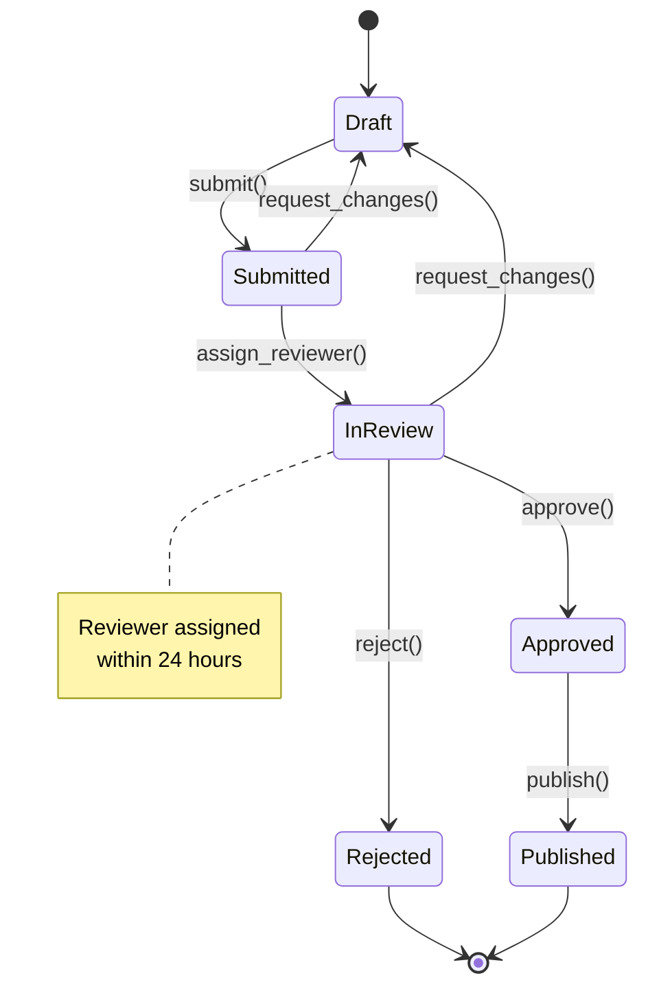
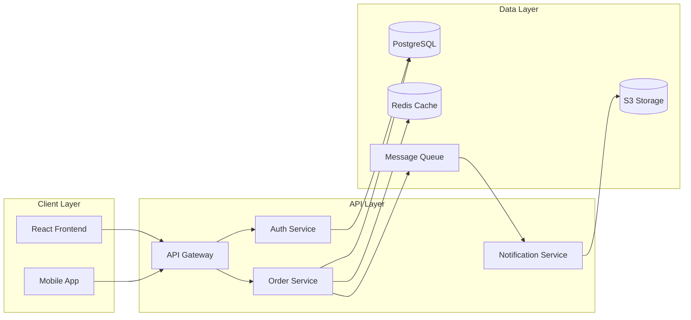
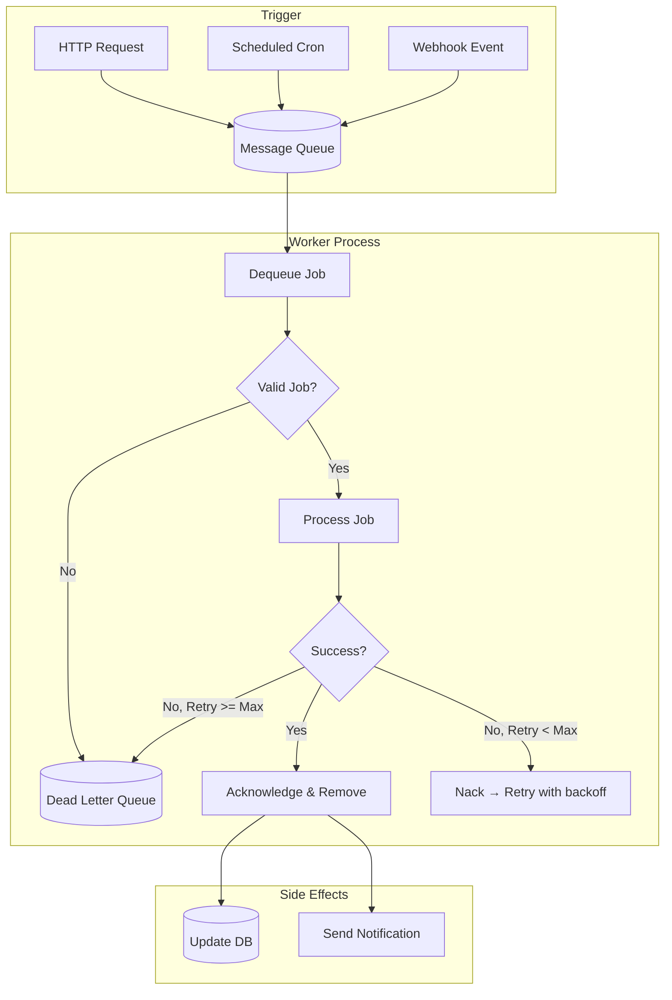
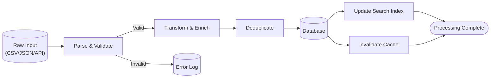
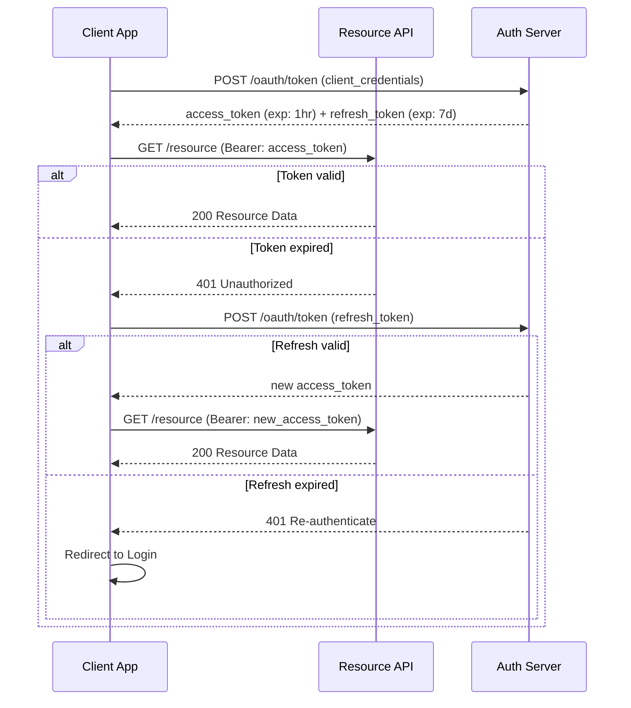

# Mermaid Diagram Templates

Ready-to-use Mermaid templates for documenting feature flows in PR descriptions. Pick the best type based on the change. Customize with actual names from the diff.

> **Confidence note:** If code intent is unclear, always prefix the diagram block with:
> `> **Note:** Best-effort generated diagram — please verify accuracy with the author.`

---

## When to Use Which Diagram Type

| Change type | Recommended diagram |
|-------------|---------------------|
| User-facing feature with steps | Flowchart |
| API request/response between services | Sequence diagram |
| Frontend state machine / user journey | Flowchart or State diagram |
| Service-to-service architecture change | Component / C4 diagram |
| Data transformation pipeline | Flowchart |
| Auth/token flow | Sequence diagram |
| Background job / worker flow | Flowchart |
| Database interaction pattern | Sequence diagram |

---

## Template 1 — Flowchart (Process / Decision Flow)

Best for: user flows, business logic, decision trees, data pipelines.



### Flowchart node shapes reference:
- `[Text]` — rectangle (process step)
- `{Text}` — diamond (decision/condition)
- `([Text])` — rounded (start/end)
- `(Text)` — rounded rectangle (subprocess)
- `[[Text]]` — subroutine
- `[(Text)]` — database
- `>Text]` — asymmetric (annotation)

### Flowchart direction options:
- `TD` — top to bottom
- `LR` — left to right
- `BT` — bottom to top
- `RL` — right to left

---

## Template 2 — Sequence Diagram (API / Service Interaction)

Best for: REST API flows, authentication handshakes, service-to-service calls, webhooks.



### Sequence diagram arrow types:
- `->>` — solid arrow (synchronous call)
- `-->>` — dashed arrow (response/async)
- `-x` — solid with X (failed call)
- `--x` — dashed with X (failed async)
- `-)` — open arrow (async fire-and-forget)

### Sequence control blocks:
- `alt [condition]` ... `else [condition]` ... `end` — conditional
- `loop [text]` ... `end` — loop
- `par [text]` ... `and [text]` ... `end` — parallel
- `opt [text]` ... `end` — optional
- `rect [color]` ... `end` — grouping

---

## Template 3 — State Diagram (State Machine / Status Flow)

Best for: order status transitions, user account states, workflow state machines.



---

## Template 4 — Component Diagram (Architecture / Module Structure)

Best for: new service integration, module architecture changes, dependency structure.



---

## Template 5 — Background Job / Worker Flow

Best for: async processing, queue consumers, scheduled jobs, event handlers.



---

## Template 6 — Data Flow / Transformation Pipeline

Best for: ETL pipelines, data processing flows, import/export features.



---

## Template 7 — Auth / Token Flow

Best for: OAuth, JWT refresh, SSO flows, API key validation.



---

## Mermaid Embedding in PR Description

Wrap diagrams in markdown fenced blocks for GitHub/GitLab rendering:

```markdown
## Feature Flow


```

GitHub, GitLab, and most modern PR tools render Mermaid natively.

For platforms that don't (e.g., Bitbucket), provide a text description as fallback:

```markdown
## Feature Flow

> **Note:** Mermaid diagram — renders on GitHub/GitLab. Plain-text flow below for other platforms.

**Flow summary:**
1. User submits form → API validates input
2. On success → save to DB → return token
3. On failure → return validation error with field details
```

---

## Diagram Accuracy Rules

1. **Only generate diagrams when code intent is clear** — if the flow is ambiguous from the diff alone, do not fabricate
2. **Prefix best-effort diagrams** with: `> **Note:** Best-effort generated — please verify with the author.`
3. **Use real names from the code** — actual function names, service names, endpoint paths from the diff
4. **Show error paths** — always include at least one failure/error branch in flowcharts and sequence diagrams
5. **Keep it simple** — if a feature has 3 steps, don't make a 15-node diagram. Aim for clarity over completeness
6. **No mind maps** — avoid `mindmap` diagram type; it produces unclear, non-actionable diagrams for PRs
