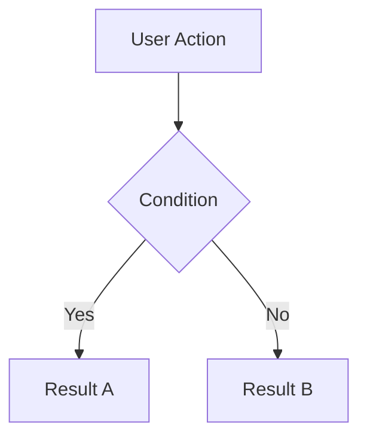

# PR Description Templates

Full templates for each PR change type. Select the matching template, fill in each section from diff analysis, and follow the accuracy rules in SKILL.md.

---

## Template 1 — Bug Fix

Use for: `bugfix` change type. Branch names like `fix/`, `hotfix/`, `bugfix/`.

```markdown
## Issue / Problem
<!-- What was broken? What did users/systems experience? Be specific. -->
<!-- If inferred from diff, label as: [Inferred from diff] -->

## Root Cause
<!-- Why did this happen? What was the underlying technical cause? -->
<!-- If inferred, label as: [Inferred from diff — please verify] -->

## Fix / Changes Made
<!-- What specifically was changed? List files and what changed in each. -->
- `src/auth/session.ts` — [what changed and why]
- `tests/auth/session.test.ts` — [what was added/updated]

## Why This Fix Works
<!-- Brief explanation of why the code change resolves the root cause. -->

## Impact / Risk
<!-- What does this change affect? What could go wrong? How was risk mitigated? -->
- Affected area: [Auth, Payments, etc.]
- Risk level: [Low / Medium / High]
- Rollback: [How to roll back if needed]

## Testing Done
<!-- List concrete testing performed. Be specific about what was tested. -->
- [ ] Unit tests added/updated
- [ ] Manual testing: [describe scenario tested]
- [ ] Edge cases: [list what was tested]
- [ ] Regression: [any existing tests that verify the fix]

## Reviewer Notes
<!-- Anything specific the reviewer should focus on, or known gaps. -->
```

---

## Template 2 — New Feature

Use for: `feature` change type. Branch names like `feature/`, `feat/`.

```markdown
## What Was Added
<!-- High-level description of the new functionality. -->

## Why / Problem Being Solved
<!-- What user need, business requirement, or gap does this feature address? -->

## How It Works — Feature Flow
<!-- Explain the flow or behavior of the new feature. Include Mermaid diagram if applicable. -->

<!-- Example Mermaid flowchart: -->
<!--

-->

## Changes Made
<!-- List the files added or modified and what each does. -->
- `src/features/new-module.ts` — [description]
- `src/routes/api.ts` — [what was added]
- `tests/features/new-module.test.ts` — [what is tested]

## New Functionality Added
<!-- Specific new capabilities, endpoints, commands, or behaviors. -->
- New API endpoint: `POST /api/v1/feature-name`
- New config key: `FEATURE_ENABLED` (default: `true`)
- New CLI command: `npm run feature:init`

## Impact / Risk
- Affected area: [what this touches]
- Feature flag: [Yes/No — flag name if applicable]
- Backward compatible: [Yes/No — explain if No]
- Risk level: [Low / Medium / High]

## Testing Done
- [ ] Unit tests added
- [ ] Integration tests added/updated
- [ ] Manual end-to-end testing: [describe]
- [ ] Edge cases tested: [list]

## Docs / README Updates
- [ ] README updated: [Yes / No / Not needed]
- [ ] API docs updated: [Yes / No / N/A]
- [ ] Config docs updated: [Yes / No / N/A]

## Reviewer Notes
```

---

## Template 3 — Refactor

Use for: `refactor` change type. Branch names like `refactor/`, `cleanup/`.

```markdown
## What Was Refactored
<!-- What code was restructured, renamed, or reorganized? -->

## Why This Refactor
<!-- What problem does this solve? (readability, maintainability, performance, test coverage, etc.) -->

## What Did NOT Change
<!-- Explicitly state what behavior is unchanged. This reassures reviewers. -->
- Public API: unchanged
- Database schema: unchanged
- External behavior: unchanged

## Changes Made
<!-- List changed files and nature of each change. -->
- `src/utils/helpers.ts` — extracted X into Y, renamed Z to W
- `src/services/user.ts` — split into smaller functions, removed dead code

## Risk Assessment
- Breaking change: No / Yes — [explain if Yes]
- Risk level: Low / Medium
- Areas to verify: [specific areas reviewers should double-check]

## Testing Done
- [ ] All existing tests pass
- [ ] New tests added for extracted logic
- [ ] Manual smoke testing performed

## Reviewer Notes
<!-- Focus areas, known risks, or specific sections to verify. -->
```

---

## Template 4 — Chore / Dependency Bump

Use for: `chore`, `dependency-bump`, `tooling` change types.

```markdown
## What Changed
<!-- What dependency, config, tooling, or script was updated. -->
- `package.json`: bumped `lodash` from 4.17.20 → 4.17.21
- `package.json`: bumped `typescript` from 4.9.0 → 5.0.4

## Why
<!-- Reason for the update: security patch, feature need, compatibility, routine maintenance. -->
- Security: resolves [CVE-XXXX-XXXX] (severity: [Critical/High/Medium])
- Compatibility: required for Node 20 support
- Routine: monthly dependency maintenance

## Compatibility
- Breaking changes in updated package: [Yes / No — describe if Yes]
- Tested against: [Node version, browser, environment]

## Testing Done
- [ ] Build passes after update
- [ ] Existing test suite passes
- [ ] Spot-checked critical functionality: [list]

## Reviewer Notes
<!-- Link to changelogs or migration guides for major version bumps. -->
```

---

## Template 5 — Mixed PR (Bug Fix + Feature + Refactor)

Use for: `mixed` change type. Multiple concerns in one PR.

```markdown
## Overview
<!-- Brief summary of all changes in this PR and why they are together. -->

---

### Part 1 — [Bug Fix / Feature / Refactor]: [Short title]

**Issue:** [what was wrong or what is being added]
**Change:** [what was done]
**Files:** [list key files]

---

### Part 2 — [Bug Fix / Feature / Refactor]: [Short title]

**Issue:** [what was wrong or what is being added]
**Change:** [what was done]
**Files:** [list key files]

---

## Shared Impact / Risk
- Risk level: [Low / Medium / High]
- Backward compatible: [Yes / No]

## Testing Done
- [ ] Tests for Part 1
- [ ] Tests for Part 2
- [ ] Regression testing across both concerns

## Reviewer Notes
<!-- Flag if this PR should have been split. If it can't be split, explain why. -->
```

---

## Template 6 — Documentation Only

Use for: `docs` change type. Only `.md`, `.txt`, docs files changed.

```markdown
## What Was Updated
<!-- Which documentation was changed and why. -->

## Why
<!-- Accuracy fix, new feature documented, setup instructions updated, etc. -->

## Reviewer Notes
<!-- Ask reviewer to verify accuracy of documented behavior against actual code. -->
```

---

## PR Title Formats by Type

| Type | Format | Example |
|------|--------|---------|
| bugfix | `Fix: [short description] [TICKET]` | `Fix: Resolve session timeout on expired JWT [JIRA-4521]` |
| feature | `Add: [short description] [TICKET]` | `Add: User notification preferences endpoint [GH-234]` |
| refactor | `Refactor: [short description]` | `Refactor: Extract auth helpers into shared module` |
| chore | `Chore: [short description]` | `Chore: Bump lodash to 4.17.21` |
| dependency | `Bump: [package] [old] → [new]` | `Bump: typescript 4.9 → 5.0` |
| docs | `Docs: [short description]` | `Docs: Update API authentication guide` |
| mixed | `[Type1] + [Type2]: [short description]` | `Fix + Refactor: Auth flow cleanup and timeout fix` |
| hotfix | `Hotfix: [short description] [TICKET]` | `Hotfix: Fix null pointer in payment processor [JIRA-5500]` |

---

## Accuracy Rules (Always Apply)

1. Label inferred content: `[Inferred from diff]`, `[Inferred from branch name]`
2. If root cause is unknown: `Root cause: [Could not be determined from available context — author should clarify]`
3. Never invent business context (ticket names, feature names, stakeholders) not present in code/commits/branch
4. Never include API keys, tokens, passwords, or internal config values in PR text
5. If diff is too large to analyze fully, state: `[Note: PR is large — this description covers the primary changes identified]`
6. For mixed PRs, always call out clearly that the PR has multiple concerns — do not blend them
